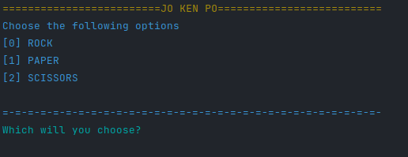

# JO-KEN-PO
 
This work was done for training in python.

 
Simple Rock, Paper Scissors game developed 100% in pyhton 3.0 language 

 
Simple syntax and easy to understand, with differentiating colors in the terminal, in which your opponent is the computer itself.

 ## Game Images
 

